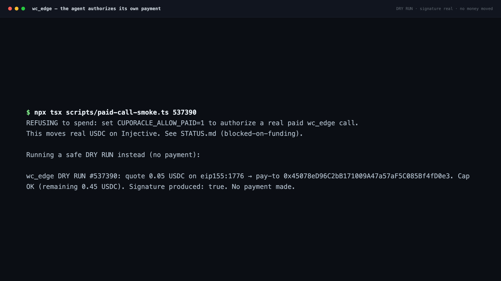
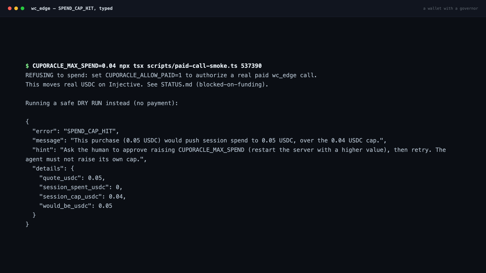
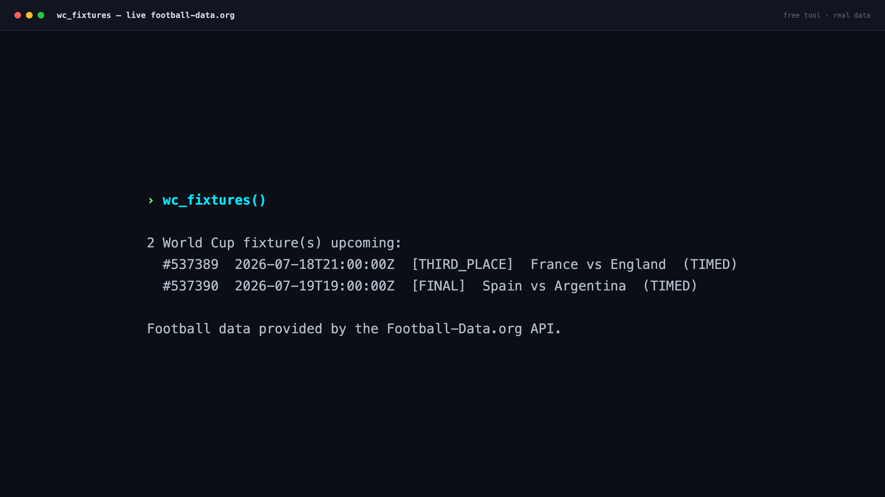
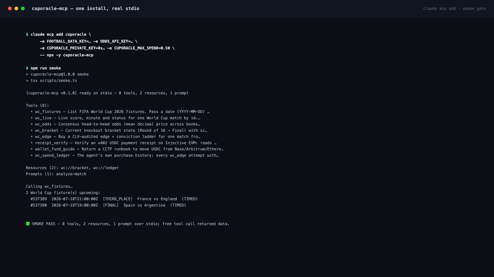
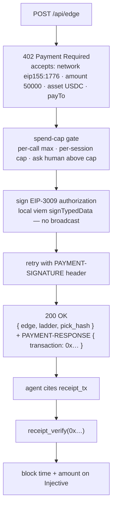

<div align="center">
  
  <h1>cuporacle-mcp</h1>
  <p><em>The missing World Cup MCP server — live data free, premium alpha bought and proven by the agent itself.</em></p>
  

  <br/><br/>

  [](https://cuporacle.edycu.dev/)
  [](https://youtu.be/FAI3_xZFTx0)
  [](https://cuporacle.edycu.dev/pitch/)
  [](https://www.npmjs.com/package/cuporacle-mcp)
  [](https://cuporacle.edycu.dev/reference.html)
  

  <br/>

  
  
  
  
  
  
  
  
  [](LICENSE)
  [](https://github.com/edycutjong/cuporacle-mcp/actions/workflows/ci.yml)
</div>

<p align="center">
  <b>Your AI assistant is football-blind during the biggest event on earth</b> — it can't see tonight's World Cup match, has no odds, and has no way to pay for premium data itself.<br/>
  <b>CupOracle is a published MCP server that fixes that:</b> live FIFA World Cup 2026 fixtures, scores, consensus odds and the knockout bracket as <b>free</b> tools — plus <b><code>wc_edge</code>, an agent that pays 0.05 USDC via Injective x402 <i>by itself</i></b> (under a spend cap) and cites the on-chain receipt.<br/>
  <b>Shipped:</b> 8 tools · 2 resources · 1 prompt over stdio · 63 vitest · MCP-Inspector-conformant in CI · live on npm (`npx -y cuporacle-mcp`).
</p>

<p align="center">📊 <strong><a href="https://cuporacle.edycu.dev/pitch/">Pitch deck</a></strong> (interactive — arrow keys · press <kbd>P</kbd> to print) · 🌐 <a href="https://cuporacle.edycu.dev/">Live site</a></p>

<table>
  <tr>
    <td width="50%"><br/><sub><b><code>wc_edge</code>, the showpiece</b> — parses a real 402, signs the EIP-3009 USDC authorization itself</sub></td>
    <td width="50%"><br/><sub><b>Spend cap enforced</b> — the agent refuses to overspend (<code>SPEND_CAP_HIT</code>)</sub></td>
  </tr>
  <tr>
    <td width="50%"><br/><sub><b>Live fixtures over MCP</b> — real World Cup data, free tools</sub></td>
    <td width="50%"><br/><sub><b>One-line install</b> — <code>claude mcp add cuporacle -- npx -y cuporacle-mcp</code></sub></td>
  </tr>
</table>

```bash
# Claude Code — the 4 free data tools work with just two free API keys
claude mcp add cuporacle -- npx -y cuporacle-mcp
```

> **Published:** [`cuporacle-mcp` is live on npm](https://www.npmjs.com/package/cuporacle-mcp)
> (also mirrored to [GitHub Packages](https://github.com/edycutjong/cuporacle-mcp/pkgs/npm/cuporacle-mcp)
> as `@edycutjong/cuporacle-mcp`), so the `npx -y cuporacle-mcp` line above works today.
> Prefer source? `git clone https://github.com/edycutjong/cuporacle-mcp && cd cuporacle-mcp && npm install && npm run smoke`.

`cuporacle-mcp` is a standalone [Model Context Protocol](https://modelcontextprotocol.io)
server that runs **side by side with the Injective MCP server**: **8 tools + 2
resources + 1 prompt** over stdio. Free data tools work out of the box; `wc_edge`
is a reference implementation of an agent *buying and proving its own alpha*
keylessly via Injective's x402.

## 🧑‍⚖️ Notes for judges — reproduce in < 5 min

- **Zero-cost path.** The four free tools (`wc_fixtures`, `wc_live`, `wc_odds`,
  `wc_bracket`) return **real live World Cup 2026 data** with just the two free
  API keys — no wallet, no funds.
- **The x402 buyer path runs with _zero funds_.** `wc_edge(matchId, dry_run: true)`
  (or `npm run paid-call-smoke`) parses the **recorded 402 quote**, enforces the
  spend cap, and signs the EIP-3009 authorization **locally** — a deterministic
  proof of the payment client with **no money moved and no fabricated receipt**.
- **< 5-minute reproduce:**
  ```bash
  npm install
  npm run smoke      # cold-start over stdio → lists 8 tools/2 resources/1 prompt + a live free call
  npm test           # 63 vitest (schemas · spend cap · 402-parse · EIP-3009 sign · receipts · degrade)
  npm run inspector  # official MCP Inspector conformance against the built dist/
  ```
- **Honestly gated (not faked) — and now proven for real:** on **2026-07-18** the
  agent made its first *real settled* `wc_edge` purchase against the live LineLock
  API — 0.05 USDC on Injective EVM mainnet, receipt tx
  [`0x89cd955cf4cab5efcb7a25cbc8e25851c8524a186f2aa449d11e4b598541a07d`](https://blockscout.injective.network/tx/0x89cd955cf4cab5efcb7a25cbc8e25851c8524a186f2aa449d11e4b598541a07d).
  Verify it yourself: `receipt_verify("0x89cd…")`. With **zero funds**, `dry_run`
  remains the reproduce path, and `wc_edge` still **degrades to free odds** —
  never an invented edge or receipt — full honest state in [`STATUS.md`](docs/STATUS.md).

---

## 💡 Why this exists

Agents have no first-class sports capability. Injective's own MCP server covers
wallets, markets, CCTP and trading — but an agent asked *"is tonight's match
worth a bet?"* has to hallucinate or scrape, and there's no pattern for an agent
*paying for premium data itself*. CupOracle is that missing layer, built as a
composable server that runs **side by side** with the Injective MCP server.

## 🧰 Tools

| Tool | Gate | Returns |
|---|---|---|
| `wc_fixtures(date?)` | free | fixtures for a day or the next upcoming window |
| `wc_live(matchId)` | free | live score, minute, status |
| `wc_odds(matchId)` | free | consensus h2h odds + de-vigged implied probabilities |
| `wc_bracket()` | free | knockout bracket state (R16 → Final) |
| `wc_edge(matchId, maxSpend?, dry_run?)` | **pays x402** | CLV-audited edge + conviction ladder + **receipt tx** |
| `receipt_verify(txHash)` | free | verifies a receipt on Injective EVM (block time, amount, payee) |
| `wallet_fund_guide(chain?)` | free | CCTP runbook to fund the agent wallet |
| `wc_spend_ledger()` | free | the agent's own purchase history: entries + receipts + session total vs cap |

**Resources:** `wc://bracket`, `wc://ledger` · **Prompt:** `analyze-match(matchId)`.

## 🚀 Quickstart

### 1. Get keys
- [football-data.org](https://www.football-data.org/) free tier → `FOOTBALL_DATA_KEY`
- [the-odds-api.com](https://the-odds-api.com/) free tier → `ODDS_API_KEY`

The four **free** data tools work with just these two keys. `wc_edge` additionally
needs a payer wallet (see [Funding](#funding-the-agent-wallet)).

### 2. Add to your harness

**Claude Desktop** (`claude_desktop_config.json`):
```json
{
  "mcpServers": {
    "cuporacle": {
      "command": "npx",
      "args": ["-y", "cuporacle-mcp"],
      "env": {
        "FOOTBALL_DATA_KEY": "…",
        "ODDS_API_KEY": "…",
        "CUPORACLE_PRIVATE_KEY": "0x…",
        "CUPORACLE_MAX_SPEND": "0.50"
      }
    }
  }
}
```

**Claude Code:**
```bash
claude mcp add cuporacle \
  -e FOOTBALL_DATA_KEY=… -e ODDS_API_KEY=… \
  -e CUPORACLE_PRIVATE_KEY=0x… -e CUPORACLE_MAX_SPEND=0.50 \
  -- npx -y cuporacle-mcp
```

**Cursor** (`.cursor/mcp.json`):
```json
{
  "mcpServers": {
    "cuporacle": { "command": "npx", "args": ["-y", "cuporacle-mcp"],
      "env": { "FOOTBALL_DATA_KEY": "…", "ODDS_API_KEY": "…" } }
  }
}
```

### 3. Ask
> *"What's tonight's Semi-Final, and is it worth a bet?"*

The assistant lists the fixture (`wc_fixtures`), pulls odds (`wc_odds`), buys a
vetted edge for ~5¢ (`wc_edge`) **paying via x402 itself**, and cites the
receipt. Paste that hash into `receipt_verify` to confirm the payment on Injective.
*(Funded path — now exercised for real: first settled receipt `0x89cd955c…541a07d`
on 2026-07-18, see "Notes for judges". With no funds, `wc_edge` dry-runs or
degrades to free odds and says so.)*

## 🛠️ Injective technologies used

CupOracle is Injective-native by construction — remove any layer and it's just a
scraper or a hosted API with a billing page.

| # | Technology | Exact surface | Where |
|---|---|---|---|
| 1 | **MCP Server** | Publishes a complete server (stdio): **8 tools + 2 resources + 1 prompt**, Inspector-conformance-checked. Extends the InjectiveLabs/mcp-server pattern and runs beside it. | the whole package |
| 2 | **x402** | Autonomous **client**: parses the 402 quote (`accepts` / `PAYMENT-REQUIRED`), signs an **EIP-3009** transfer authorization, retries with `PAYMENT-SIGNATURE`, reads the receipt from `PAYMENT-RESPONSE`. Uses [`@injectivelabs/x402`](https://www.npmjs.com/package/@injectivelabs/x402) `./client` + `./eip3009`. | `src/x402/`, `wc_edge` |
| 3 | **Agent Skills** | Ships the `cuporacle` Skill: tool-selection table, spend policy, fund-if-broke runbook. | `skills/cuporacle/SKILL.md` |
| 4 | **USDC + CCTP** | Native USDC `0xa00C…235a` (Circle FiatTokenV2_2, EIP-3009). Funding path routes to the Injective MCP server's `cctp_supported_chains` → `cctp_attestation_status` → `cctp_mint`. | `wallet_fund_guide`, Skill |
| 5 | **Injective EVM** | Mainnet `eip155:1776` (Blockscout + `sentry.evm-rpc.injective.network`), testnet `eip155:1439`. `receipt_verify` reads the tx over the EVM RPC. | `src/networks.ts`, `receipt_verify` |

> **Interop, not wrap.** CupOracle does **not** reimplement chain ops or wrap the
> Injective MCP tools as its own — both servers run in the same harness and the
> Skill routes funding to Injective's tools. Honesty over land-grab.

## 🔄 The autonomous-payment loop (`wc_edge`)



Spending is **auditable in-conversation** via `wc_spend_ledger` (and `wc://ledger`).
Failures teach: `INSUFFICIENT_USDC` carries the CCTP runbook; `SPEND_CAP_HIT`
carries the cap and how to raise it (ask the human — the agent never raises its own).

## 💰 Funding the agent wallet

`wc_edge` needs a few **cents** of USDC on Injective. Generate a throwaway payer
wallet and fund it via CCTP:

```bash
npx cuporacle-mcp init          # prints a fresh wallet address + key
```

Then call `wallet_fund_guide` (or ask your agent to) for the CCTP steps, executed
with the Injective MCP server: `account_balances → cctp_supported_chains → burn on
Base (domain 6) → cctp_attestation_status → cctp_mint`. Fund only cents; the
default cap is 0.50 USDC.

## 🧑‍💻 Development

```bash
npm install
npm run smoke  # cold-start over stdio, list 8 tools/2 resources/1 prompt, one live call
npm test       # 63 vitest (schemas, spend cap, 402-parse, EIP-3009 sign, receipts, degrade)
npm run bench  # cache hit/miss + wc_edge dry_run (parse+sign) p50/p95
npm run build  # tsup → dist (publish-ready)
SMOKE_BIN=dist npm run smoke  # smoke the built artifact
```

`npm run paid-call-smoke` runs a **real** paid `wc_edge` end-to-end — it is
funds-gated behind `CUPORACLE_ALLOW_PAID=1` and a funded key, and otherwise falls
back to a dry run.

## 🧪 Engineering harness & CI

This is a **published npm library**, not a web app — so the pipeline swaps the
usual browser E2E / Lighthouse stages for the two proofs that actually matter for
a stdio MCP server: a cold-start over **real stdio** (`npm run smoke`) and
official **MCP Inspector** protocol conformance against the built `dist/`.

Multi-stage **[CI](.github/workflows/ci.yml)**: Quality → Security → Build → MCP Conformance → Publish-readiness.

```bash
# ── Quality ─────────────────────────────────
npm run typecheck   # tsc --noEmit (strict)
npm test            # vitest — 63 passing
npm run ci          # typecheck + test + build + smoke (local gate)

# ── MCP "E2E" (no browser — this is the end-to-end proof) ──
npm run smoke       # cold-start over stdio → 8 tools / 2 resources / 1 prompt + a live free call
npm run inspector   # official MCP Inspector conformance against dist/
SMOKE_BIN=dist npm run smoke   # smoke the exact built artifact npm ships

# ── Security ────────────────────────────────
make security-scan  # npm audit + license-checker (no GPL/AGPL in prod deps)
```

| Layer | Tool | Status |
|---|---|---|
| Type safety | TypeScript (`tsc --noEmit`, strict) | ✅ |
| Unit / contract tests | **Vitest** — 63 passing (schemas · spend cap · 402-parse · EIP-3009 sign · receipts · degrade) | ✅ |
| Protocol "E2E" (smoke) | **MCP stdio smoke** — cold-start lists 8 tools / 2 resources / 1 prompt + a live free call | ✅ |
| Protocol conformance | **MCP Inspector** (`@modelcontextprotocol/inspector`) — `tools/list` · `resources/list` · `prompts/list` | ✅ |
| Static analysis (SAST) | **CodeQL** (`javascript-typescript`, security-and-quality) | ✅ |
| Dependency updates (SCA) | **Dependabot** (npm + github-actions, weekly) + `npm audit` | ✅ |
| Secret scanning | **TruffleHog** (verified-only) | ✅ |
| Publish readiness | `npm pack` / `npm publish` **dry-run** gate (provenance publish is manual) | ✅ |

> **No Playwright / Lighthouse** — there is no browser surface to drive or audit.
> The equivalent guarantee is the stdio smoke + Inspector conformance above, both
> run in CI on every push and PR. Also see [`make help`](Makefile) for the full
> target list.

## ⚙️ Configuration

| Env | Default | Meaning |
|---|---|---|
| `FOOTBALL_DATA_KEY` | — | football-data.org key (free data tools) |
| `ODDS_API_KEY` | — | the-odds-api.com key (odds) |
| `CUPORACLE_PRIVATE_KEY` | — | payer wallet key for `wc_edge` (fund cents only) |
| `CUPORACLE_MAX_SPEND` | `0.50` | per-session USDC spend cap |
| `CUPORACLE_NETWORK` | `eip155:1776` | `eip155:1776` mainnet · `eip155:1439` testnet |
| `LINELOCK_URL` | `https://linelock.edycu.dev` | upstream edge provider |

## 🧩 Extend it (add your own sport)

Each tool is `{ name, config, handler }` (`src/tools/`). To add, say, a cricket
server: copy a free tool, swap the data client in `src/data/`, register it in
`src/tools/index.ts`. The x402 client (`src/x402/`) is sport-agnostic — reuse it
to sell any premium signal. PRs welcome.

## ⚠️ Honest limitations

1. `wc_edge` depends on LineLock's `/api/edge` (a disclosed sibling project).
   If it's down, `wc_edge` degrades to free odds — it never fabricates an edge.
2. Free-tier data APIs cap request rates → 60s cache + committed snapshots
   (always labeled `[snapshot]`).
3. The payer keystore holds a real (tiny) balance. Spend caps default low; fund
   only cents. Windows keystore paths are documented, not hardened.

## 📄 License

MIT. "Football data provided by the Football-Data.org API."
