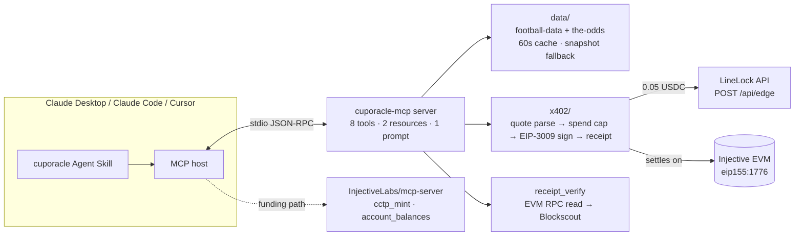

# Architecture — cuporacle-mcp

## Stack

TypeScript · [`@modelcontextprotocol/sdk`](https://www.npmjs.com/package/@modelcontextprotocol/sdk)
`1.29.0` (stdio transport, `registerTool`/`registerResource`/`registerPrompt`) ·
`zod` tool schemas · football-data.org + the-odds-api.com data clients with a 60s
TTL cache + labeled snapshot fallback · **x402 client** via
[`@injectivelabs/x402`](https://www.npmjs.com/package/@injectivelabs/x402) `0.0.1`
(`./client` + `./eip3009`) · `viem` for signing + RPC reads · AES-256-GCM keystore ·
`tsup` build → npm `cuporacle-mcp`.

> **Correction to the pre-build spec.** The spec draft said the x402 client used
> "ethers v6 / EIP-712". The shipped `@injectivelabs/x402` package is **viem-based
> and signs EIP-3009** (`transferWithAuthorization`), and ships a first-party
> client. We use it directly (`createInjectiveClient`, `createPayment`,
> `signAuthorization`, `parsePaymentRequired`, `parsePaymentResponseHeader`) — no
> hand-rolled ethers signing. APIs were pinned by reading the package's shipped
> `dist/*.d.ts`.

## System diagram



## Layout

```
src/
  server.ts          McpServer over stdio; registers 8 tools + 2 resources + 1 prompt
  config.ts          env loader (.env.local/.env) + typed config
  errors.ts          CupOracleError + typed codes (SPEND_CAP_HIT, INSUFFICIENT_USDC, …)
  networks.ts        Injective network meta (re-exported from x402) + USDC unit math
  tools/             wc_fixtures wc_live wc_odds wc_bracket wc_edge
                     receipt_verify wallet_fund_guide wc_spend_ledger (+ shared.ts)
  data/              football.ts · odds.ts · bracket.ts · cache.ts
  x402/              client.ts (quote/sign/paidFetch) · spend.ts (governance) · receipts.ts (ledger)
  keystore/          keystore.ts (AES-256-GCM + generateWallet)
bin/cuporacle-mcp.ts npx entry (server | init | --help)
skills/cuporacle/    SKILL.md
scripts/             smoke.ts · bench.ts · snapshot.ts · paid-call-smoke.ts (funds-gated)
fixtures/            edge-402-quote.json (recorded) · edge-success.json · wc-snapshot.json · odds/
test/                63 vitest
```

## The x402 client module (honest-depth core)

1. `POST {LINELOCK_URL}/api/edge` → `402` with `accepts[]` (body) or a base64
   `PAYMENT-REQUIRED` header. `quoteFromResponse` parses either.
2. **Spend governance** (`x402/spend.ts`): per-call max, per-session cap, and a
   hard "ask the human above cap" rule → typed `SPEND_CAP_HIT`. The agent never
   raises its own cap.
3. **Sign** the EIP-3009 `transferWithAuthorization` **locally** (`viem`
   `signTypedData` — no broadcast, no funds needed to sign) → base64
   `PAYMENT-SIGNATURE`.
4. Retry → `200` carries `PAYMENT-RESPONSE` = base64 `{ success, transaction,
   network, payer }`. **`transaction` is the receipt** `wc_edge` cites and
   `receipt_verify` checks.
5. Typed failures: `INSUFFICIENT_USDC` (carries the CCTP runbook), `PAYMENT_DECLINED`,
   `SPEND_CAP_HIT`, `UPSTREAM_UNAVAILABLE` (→ graceful degrade to free odds).

Because signing is offline, the whole client is provable against a **recorded 402
quote** with no funds and no live upstream — see `test/x402.test.ts` and
`wc_edge(matchId, dry_run: true)`.

## MCP citizenship

Beyond tools, the server registers **resources** `wc://bracket` / `wc://ledger`
(read-only mirrors) and a **prompt** `analyze-match(matchId)` composing
fixtures→odds→edge with the spend policy inline — verified by the official
`@modelcontextprotocol/inspector` (`tools/list`, `resources/list`, `prompts/list`).

## Residual risks (mitigated)

- **Data-API limits** → 60s cache + committed snapshot fallback, always labeled.
- **Keystore UX on fresh machines** → `cuporacle-mcp init` + `wallet_fund_guide`.
- **LineLock dependency** → `wc_edge` degrades to `wc_odds` + "no vetted edge
  available"; never fabricates.
